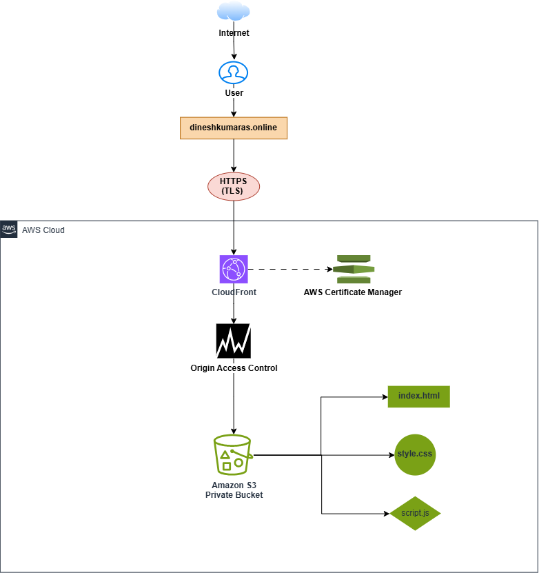
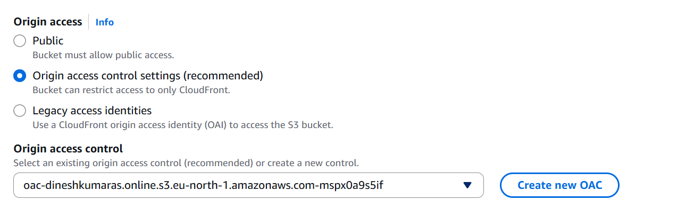
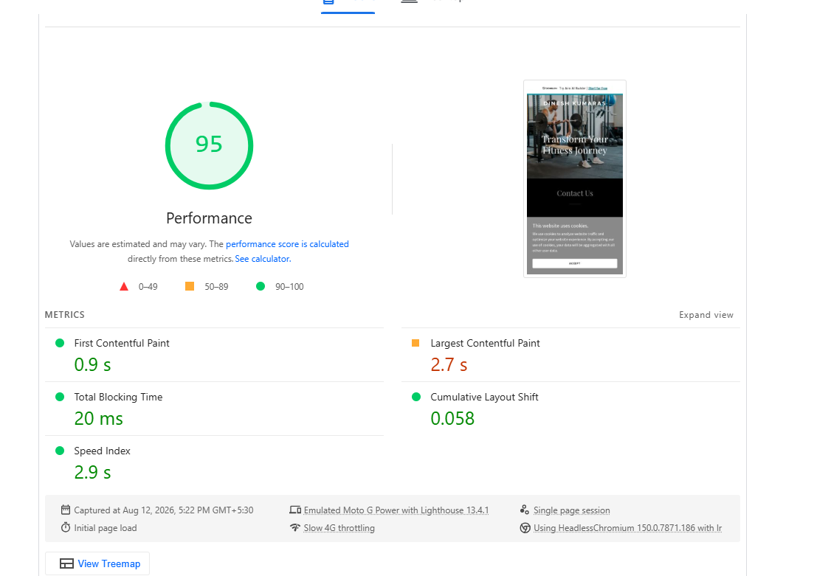
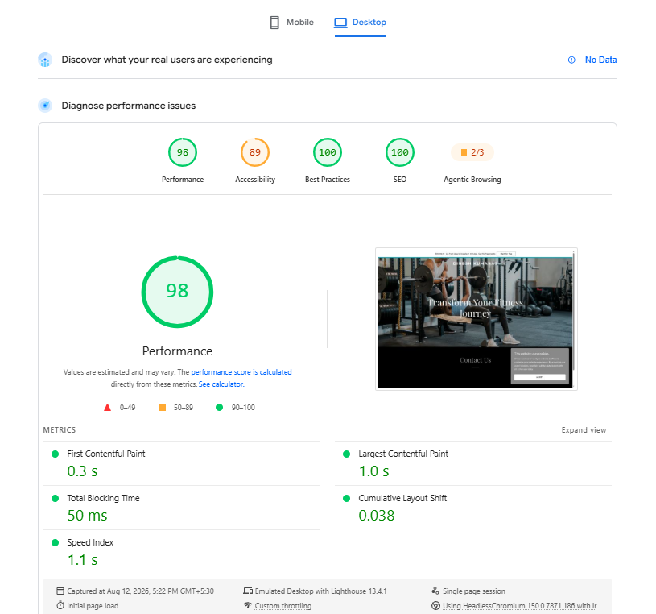

# Secure Static Website Hosting on AWS

## Project Overview

A secure, production-style static portfolio website hosted on **Amazon
S3** and delivered globally through **Amazon CloudFront**.

The S3 bucket is private and CloudFront accesses it using **Origin
Access Control (OAC)**. HTTPS is provided through **AWS Certificate
Manager (ACM)**, while the custom domain is managed through **GoDaddy
DNS**.

### Live Website

-   https://dineshkumaras.online
-   https://www.dineshkumaras.online

------------------------------------------------------------------------

## Architecture



``` text
Internet
   |
   v
dineshkumaras.online
   |
   v
GoDaddy DNS
   |
   v
Amazon CloudFront
   |
   | HTTPS / TLS
   v
Origin Access Control (OAC)
   |
   v
Private Amazon S3 Bucket
   |
   +-- index.html
   +-- style.css
   +-- script.js
   +-- images/
```

### Request Flow

1.  User requests the custom domain.
2.  GoDaddy DNS directs traffic to CloudFront.
3.  CloudFront terminates HTTPS.
4.  CloudFront uses OAC to authenticate to the S3 origin.
5.  The private S3 bucket returns the requested object.
6.  CloudFront caches and delivers the content from edge locations.

------------------------------------------------------------------------

## Objectives

-   Host a static website securely using Amazon S3.
-   Keep the S3 bucket private.
-   Use CloudFront as a CDN.
-   Secure S3 access using Origin Access Control.
-   Implement HTTPS using ACM.
-   Configure a third-party custom domain through GoDaddy.
-   Monitor CloudFront traffic and errors with CloudWatch.
-   Measure website performance using PageSpeed Insights.
-   Document the complete implementation for a cloud portfolio.

------------------------------------------------------------------------

## AWS Services

  Service                   Purpose
  ------------------------- ---------------------------------
  Amazon S3                 Private website object storage
  Amazon CloudFront         CDN and global content delivery
  Origin Access Control     Secure CloudFront-to-S3 access
  AWS Certificate Manager   TLS certificate / HTTPS
  Amazon CloudWatch         CloudFront monitoring
  GoDaddy DNS               Custom domain DNS
  HTML/CSS/JavaScript       Website
  GitHub                    Source code and documentation
  PageSpeed Insights        Performance testing

------------------------------------------------------------------------

# Implementation

## 1. Website Development

The website was created using:

``` text
website/
├── index.html
├── style.css
├── script.js
└── images/
```

The files were tested locally and then uploaded to Amazon S3.

------------------------------------------------------------------------

## 2. Amazon S3

An S3 bucket was created to store the website files.

### Security configuration

-   Block Public Access: **Enabled**
-   Bucket Versioning: **Enabled**
-   Server-side encryption: **Enabled**
-   Static Website Hosting: **Disabled**
-   Public object access: **Disabled**
-   CloudFront OAC: **Enabled**

Static Website Hosting was intentionally disabled because the final
design uses CloudFront with the S3 REST origin and OAC.

------------------------------------------------------------------------

## 3. S3 Versioning

S3 Versioning was enabled to protect objects from accidental deletion or
overwriting.

Versioning allows previous versions of website files to be retained and
recovered.

------------------------------------------------------------------------

## 4. Origin Access Control

CloudFront OAC was configured so that the S3 bucket does not need to be
public.

``` text
User
 |
 v
CloudFront
 |
 | Signed request
 v
OAC
 |
 v
Private S3
```

This provides a secure CloudFront-to-S3 access path.

------------------------------------------------------------------------

## 5. S3 Bucket Policy

The bucket policy grants `s3:GetObject` permission to the CloudFront
service principal and restricts access to the specific CloudFront
distribution.

Example structure:

``` json
{
  "Version": "2008-10-17",
  "Statement": [
    {
      "Sid": "AllowCloudFrontServicePrincipal",
      "Effect": "Allow",
      "Principal": {
        "Service": "cloudfront.amazonaws.com"
      },
      "Action": "s3:GetObject",
      "Resource": "arn:aws:s3:::BUCKET-NAME/*",
      "Condition": {
        "ArnLike": {
          "AWS:SourceArn": "arn:aws:cloudfront::ACCOUNT-ID:distribution/DISTRIBUTION-ID"
        }
      }
    }
  ]
}
```

No public `Principal: "*"` access is used for the S3 objects.

> Redact AWS account IDs and other internal identifiers before
> publishing screenshots.

------------------------------------------------------------------------

## 6. AWS Certificate Manager

An Amazon-issued public certificate was created in **US East (N.
Virginia) / `us-east-1`** for CloudFront.

The certificate covers:

``` text
dineshkumaras.online
www.dineshkumaras.online
```

DNS validation was completed through GoDaddy DNS.

The certificate is attached to CloudFront to provide HTTPS.

------------------------------------------------------------------------

## 7. Amazon CloudFront

CloudFront was configured with the S3 bucket as the origin.

### Configuration

-   S3 origin
-   Origin Access Control enabled
-   Default root object: `index.html`
-   HTTPS/TLS enabled
-   Custom domain configured
-   ACM certificate attached
-   IPv6 enabled
-   CloudFront caching enabled
-   WAF not enabled in the initial implementation
-   Viewer mutual TLS disabled
-   Continuous deployment not used

### Distribution

``` text
d39jw6lgnhyjy6.cloudfront.net
```

The distribution successfully serves content from the private S3 origin.

------------------------------------------------------------------------

# 🔐 Origin Access Control (OAC)

Amazon CloudFront Origin Access Control (OAC) was configured to securely access the private Amazon S3 bucket.



The S3 bucket does not allow public object access. CloudFront uses OAC to authenticate requests to the S3 origin.

### Access Flow

```text
User
  |
  v
CloudFront
  |
  | Origin Access Control
  v
Private S3 Bucket

------------------------------------------------------------------------

## 8. GoDaddy DNS

The domain was purchased and managed through GoDaddy.

The `www` record was configured as:

``` text
Type: CNAME
Name: www
Value: d39jw6lgnhyjy6.cloudfront.net
TTL: 1 Hour
```

The root domain was also successfully configured and verified.

### Final DNS flow

``` text
dineshkumaras.online
        |
        v
     GoDaddy
        |
        v
    CloudFront
        |
        v
    Private S3
```

------------------------------------------------------------------------

# Monitoring

Amazon CloudWatch was used to monitor CloudFront metrics.


The dashboard includes:

-   Requests
-   Bytes Downloaded
-   Bytes Uploaded
-   4xx Error Rate
-   5xx Error Rate
-   Total Error Rate

CloudWatch alarms were not added because alarm configuration was already
covered in a separate monitoring project.

------------------------------------------------------------------------

# Performance Testing

Google PageSpeed Insights was used to test the deployed website.

## Mobile



  Metric                           Result
  -------------------------- ------------
  Performance                  **95/100**
  First Contentful Paint        **0.9 s**
  Largest Contentful Paint      **2.7 s**
  Total Blocking Time           **20 ms**
  Cumulative Layout Shift       **0.058**
  Speed Index                   **2.9 s**

## Desktop



  Metric                            Result
  -------------------------- -------------
  Performance                   **98/100**
  Accessibility                 **89/100**
  Best Practices               **100/100**
  SEO                          **100/100**
  First Contentful Paint         **0.3 s**
  Largest Contentful Paint       **1.0 s**
  Total Blocking Time            **50 ms**
  Cumulative Layout Shift        **0.038**
  Speed Index                    **1.1 s**

The results demonstrate strong performance for both mobile and desktop
delivery.

------------------------------------------------------------------------

# Challenges and Resolutions

## CloudFront account verification

CloudFront resource creation was initially restricted by AWS account
verification. The AWS support/verification process was completed before
continuing with the deployment.

## S3 AccessDenied

The initial CloudFront endpoint returned `AccessDenied`.

The origin access configuration and S3 bucket policy were verified so
that the CloudFront service principal could retrieve objects through
OAC. The CloudFront endpoint then successfully served the website.

## `www` HTTPS issue

The `www` hostname initially returned an SSL protocol error because it
had not yet been configured as an Alternate Domain Name on CloudFront.

The `www.dineshkumaras.online` hostname was added to CloudFront and
covered by the ACM certificate. The GoDaddy CNAME was then pointed to
CloudFront.

------------------------------------------------------------------------

# Security Design

The project uses multiple security controls:

-   Private S3 bucket
-   S3 Block Public Access
-   S3 Versioning
-   CloudFront Origin Access Control
-   Restricted S3 bucket policy
-   HTTPS/TLS using ACM
-   CloudFront as the public entry point

The intended access path is:

``` text
Internet
   |
   v
CloudFront
   |
   v
OAC
   |
   v
Private S3
```

------------------------------------------------------------------------

# 🌐 Final Website

The website was successfully deployed and is accessible through the custom HTTPS domain.


### Live Website

**https://dineshkumaras.online**

**https://www.dineshkumaras.online**

### Final Deployment Flow

```text
User
  |
  v
GoDaddy DNS
  |
  v
Amazon CloudFront
  |
  | Origin Access Control
  v
Private Amazon S3
  |
  v
Portfolio Website

------------------------------------------------------------------------

# Repository Structure

``` text
aws-secure-static-website/
|
├── website/
│   ├── index.html
│   ├── style.css
│   ├── script.js
│   └── images/
|
├── architecture/
│   └── architecture-diagram.png
|
├── screenshots/
│   ├── s3/
│   ├── cloudfront/
│   ├── acm/
│   ├── godaddy/
│   ├── cloudwatch/
│   └── performance/
|
├── README.md
└── LICENSE
```

------------------------------------------------------------------------

# Screenshot Evidence

Recommended evidence:

1.  S3 bucket
2.  S3 Versioning
3.  S3 security/properties
4.  S3 Block Public Access
5.  S3 Bucket Policy
6.  CloudFront distribution
7.  CloudFront OAC
8.  ACM certificate
9.  GoDaddy DNS
10. CloudWatch dashboard
11. Final HTTPS website
12. PageSpeed mobile
13. PageSpeed desktop

------------------------------------------------------------------------

# Lessons Learned

This project provided hands-on experience with:

-   Amazon S3
-   S3 security and bucket policies
-   S3 Versioning
-   CloudFront distributions
-   CloudFront caching
-   Origin Access Control
-   AWS Certificate Manager
-   TLS/HTTPS
-   GoDaddy DNS
-   CloudWatch monitoring
-   CDN-based content delivery
-   Performance testing
-   Troubleshooting S3 and CloudFront access issues

------------------------------------------------------------------------

# Future Enhancements

Possible improvements include:

-   AWS WAF
-   CloudFront security headers
-   Custom CloudFront error pages
-   S3 lifecycle policies
-   Terraform infrastructure as code
-   GitHub Actions CI/CD
-   Automated CloudFront cache invalidation
-   Route 53 DNS management
-   Additional CloudWatch alarms
-   Improved accessibility

------------------------------------------------------------------------

# Resume Highlights

-   Designed and deployed a secure static website using **Amazon S3 and
    Amazon CloudFront**.
-   Secured a private S3 origin using **CloudFront Origin Access Control
    (OAC)** and a restricted S3 bucket policy.
-   Implemented **HTTPS using AWS Certificate Manager (ACM)** and
    connected a custom GoDaddy domain.
-   Enabled **S3 Versioning and Block Public Access** to improve storage
    security and data protection.
-   Configured **CloudWatch CloudFront metrics** for requests, data
    transfer, and HTTP error monitoring.
-   Performed performance testing using **Google PageSpeed Insights**,
    achieving **95/100 mobile** and **98/100 desktop performance**
    scores.

------------------------------------------------------------------------

# Project Status

**Completed ✅**

Live website:

**https://dineshkumaras.online**

**https://www.dineshkumaras.online**
